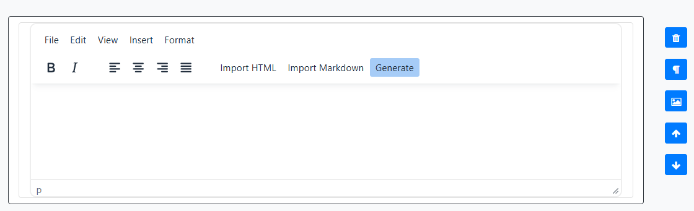
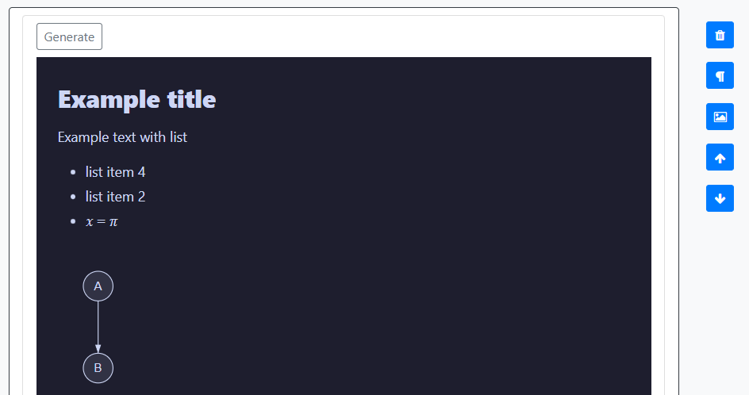
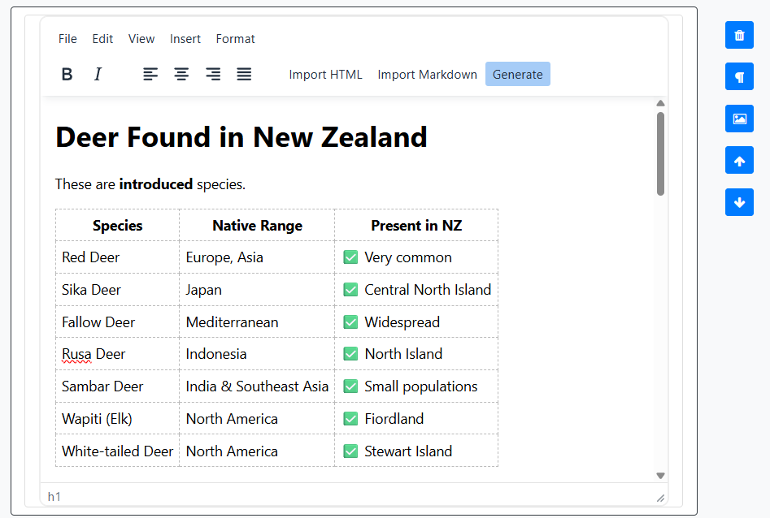
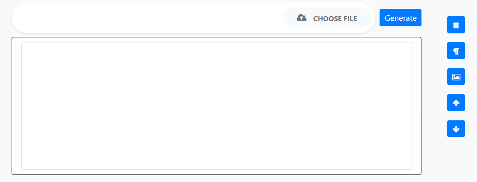
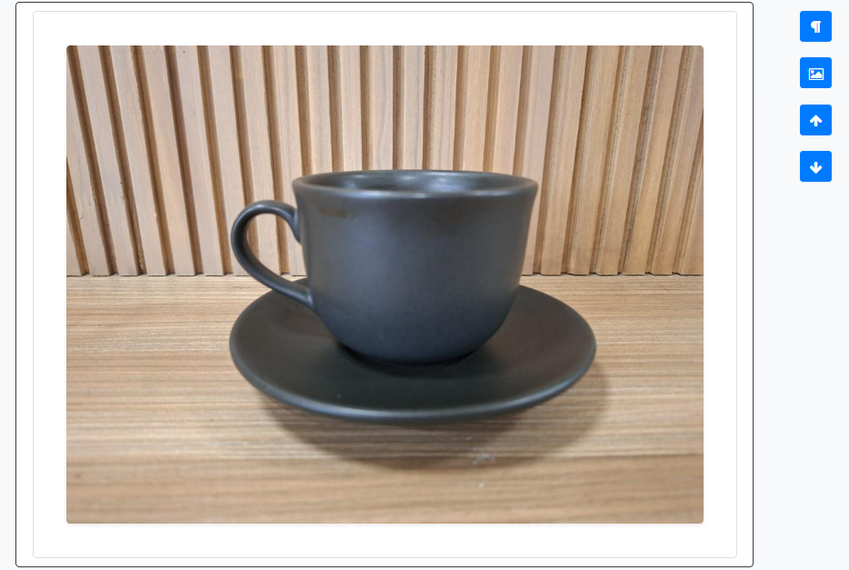
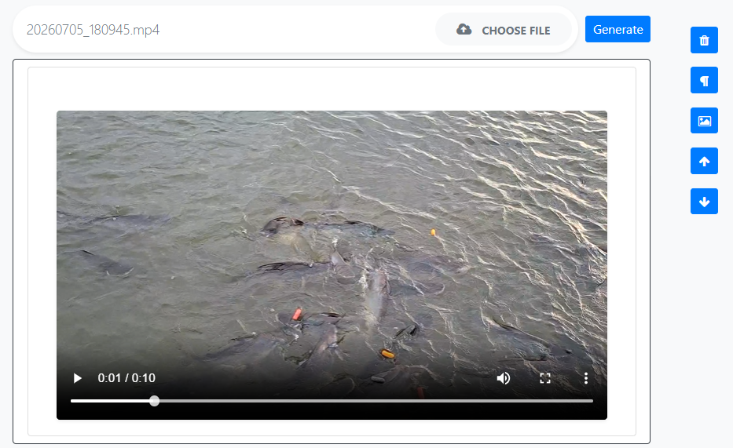
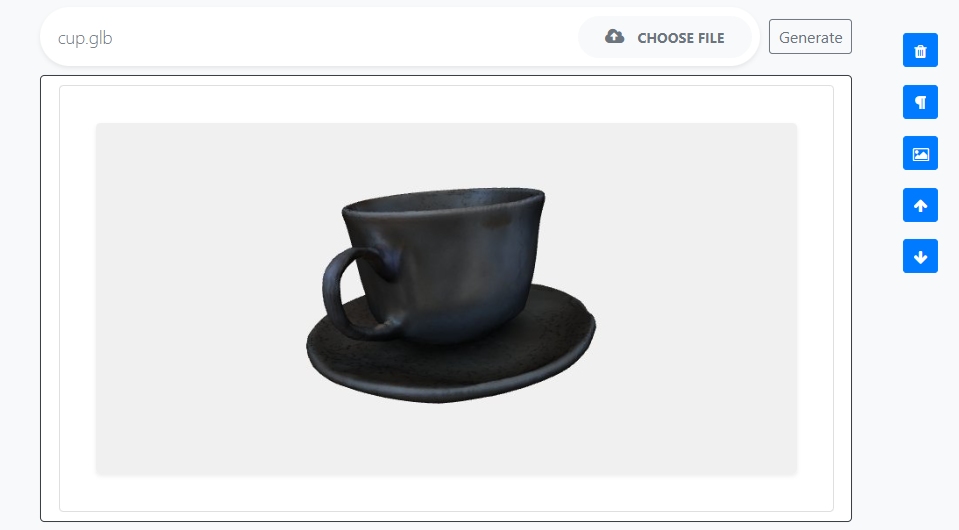
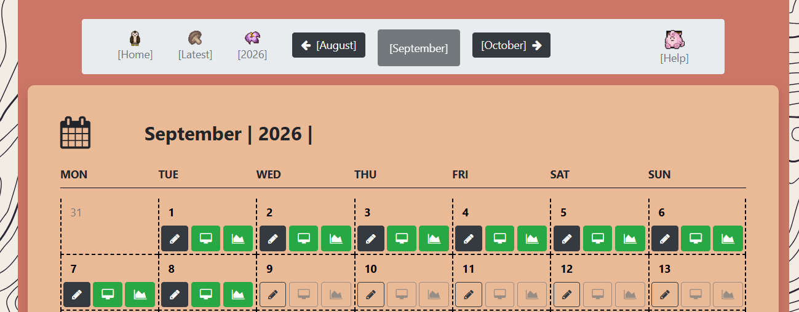

## Locally Hosted Django Journal  [](https://github.com/Mazchoo/JournalApp/actions/workflows/main.yml) [](https://github.com/Mazchoo/JournalApp/actions/workflows/frontend.yml)


## Description

Creates a locally hosted journal app that can store images, text, html, meshes and video.

* Organises entries by year, month and day in respective calendars
* Has random selections of photos shown by year and month

The `ENTRY_FOLDER` folder contains all images and videos organised by folder `yyyy/mm/dd` and is private. 

## Installation

To run locally:

```
pip install -r requirements.txt
python manage.py runserver
Open up address on browser at "http://127.0.0.1:8000/"
```

## Sample screenshots


## Usage

### Adding paragraphs to a page

Open a day from the month calendar with the pencil button. On that day's page you can add text in two ways:

* **New Paragraph** at the bottom of the page adds a text block at the end of the entry.
* The **paragraph button** beside an existing block inserts a new paragraph immediately above that block.

Click in the editor to write. When you are finished, use **Save** to keep the content. The height of the editor can be adjusted by dragging the bottom of the editor and is also saved.



#### Import HTML

A paragraph can also show a raw HTML document instead of the usual editor. In the paragraph toolbar, use **Import HTML** and choose a `.html` or `.htm` file.

The document replaces that paragraph and is shown as it would appear in a browser. Click the preview to edit the raw HTML. Use **Save** to keep the raw html content.



#### Import Markdown

In the paragraph toolbar, use **Import Markdown** and choose a `.md` or `.markdown` file.

Supported markdown features are shown in the editor. The editor largely supports markdown text features.



### Adding media to a page

On a day's page you can add photos, video, or a 3D mesh in two ways:

* **New Media** at the bottom of the page adds a media block at the end of the entry.
* The **picture button** beside an existing block inserts a new media block immediately above it.

Use **Choose file** to pick one or more files. The type is chosen from the file extension.



#### Images

Click an image to view it at full resolution.

Supported types: **.png**, **.jpg**, **.jpeg**, **.jfif** and **.svg**.



#### Video

Videos play in place with playback controls. On a reloaded page, click the video frames collage to view the video.

Supported type: **.mp4**.



#### Mesh

A mesh is shown as a 3D model you can view in the entry. Click the model first so the controls apply to it:

* **Middle-click and drag** to orbit around the model.
* **Scroll the mouse wheel** to zoom in and out.
* **W A S D** to pan up, left, down, and right.
* **Q** and **E** to roll the view.

Supported type: **.glb**.



### Navigating the calendar

Entries are organised as years, then months, then days.

* **Home** in the top bar shows every year as a carousel. Click a year to open it, or use the previous and next arrows to browse years.
* On a **year** page, click a month to open its calendar. The arrows in the top bar move to the previous or next year.
* The **month** calendar shows each day. Click the pencil to open that day's entry. A filled pencil means an entry already exists; an outlined pencil is an empty day you can start writing. Use the arrows to move between months, or click the year in the top bar to go back.
* On a **day** page, the top bar links to the year and month. The arrows move to the previous or next day.
* **Latest** in the top bar jumps to the entry you edited most recently.



